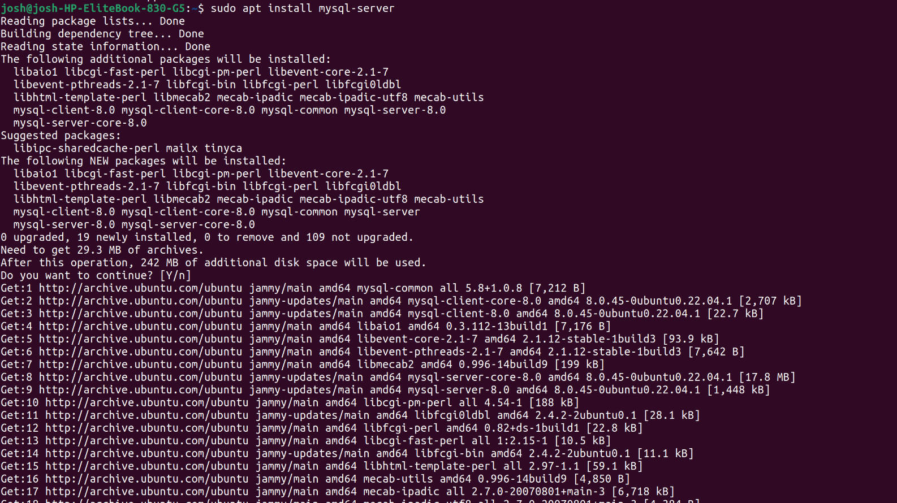
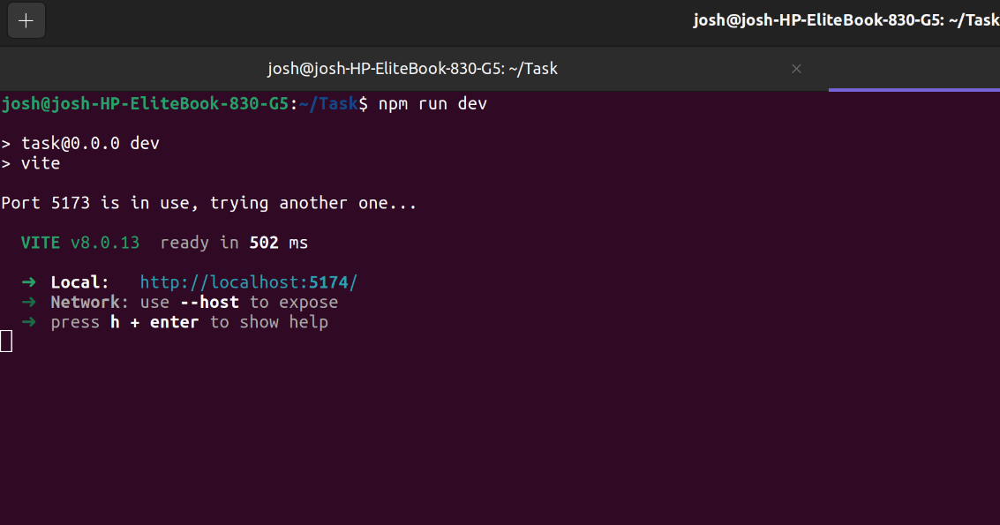
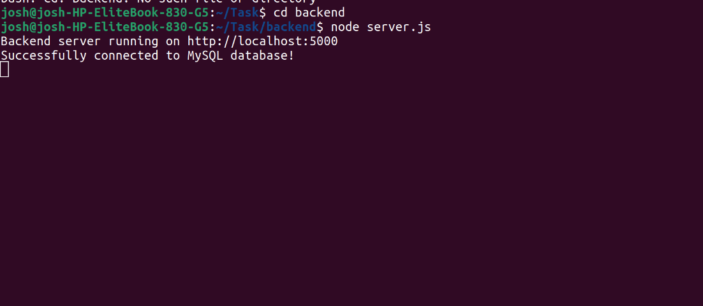

# Week 1: LOCAL ENVIRONMENT

## Installation of MySQL and its Environment
I installed mysql-server and mysql-workbench which is a database app to display the records in tables.

## Running of MySQL server
This is where Mysql server is running after successful connection of my website to the database.

## Localhost Test Page
The command `npm run dev` starts the vite development server for my web application. Vite compiles the project successfully and launches it successfully on the local host link. The figure below shows the hello world test page.

## Database Connection Test

