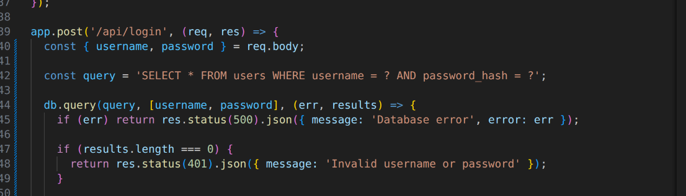
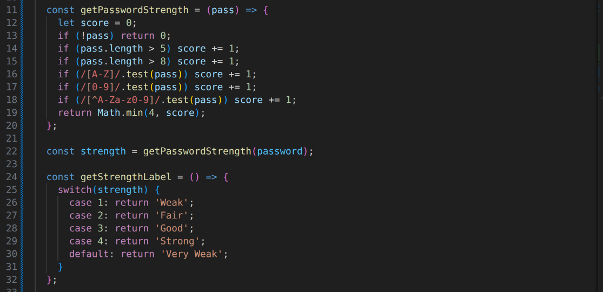
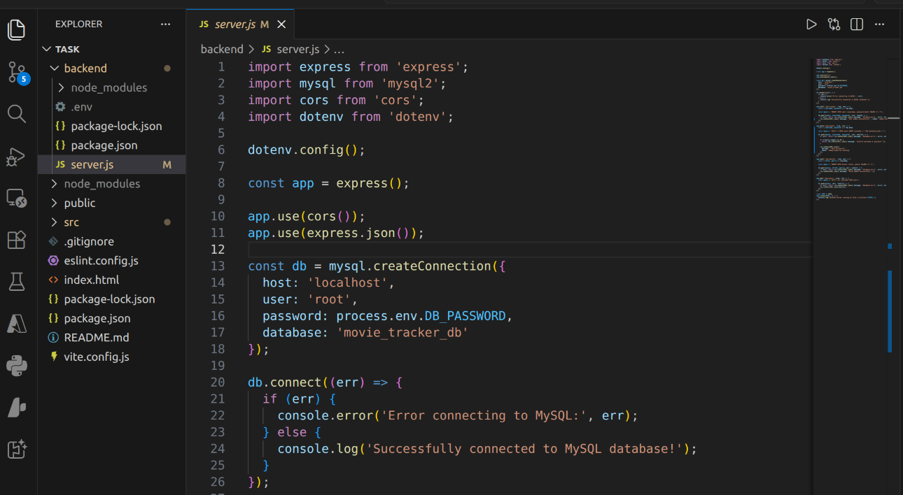

# Week 3

## JavaScript Form Validation and Password Strength Checker
In the form, one cannot submit data while the username field is empty. The form also includes a password strength checker feature that validates the strength of the password. It is designed to evaluate user password strength by evaluation of length, number, uppercase, symbols.

## Database Connection Script
The figure shows a backend script for establishing connection of my web app to my local mysql workbench database.

