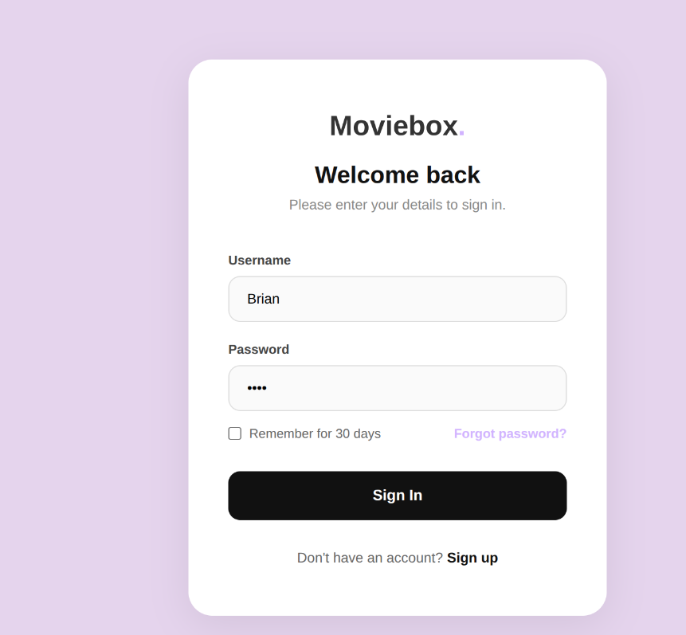
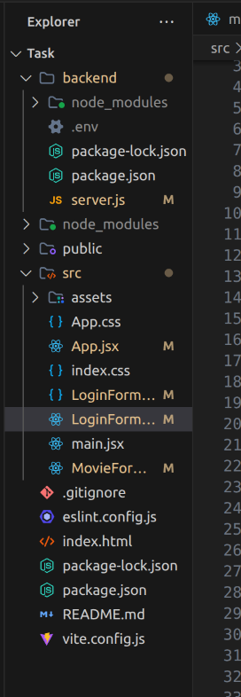
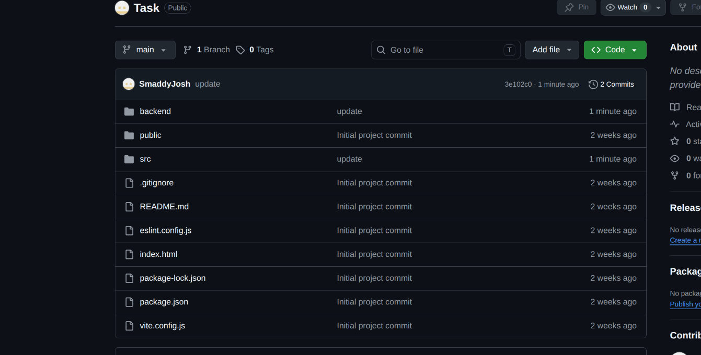

# Week 4

## Login Form
The figure shows a user interface designed for authentification using a password to access the web app.

## Folder Structure
The figure shows the folder structure for my web application which contains the backend folder and frontend folder.

## Github Updates
The figure shows an organized repository history that track addition of features.

