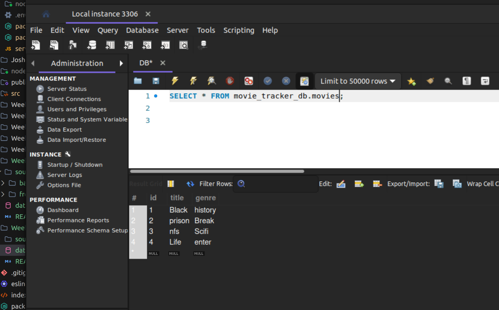
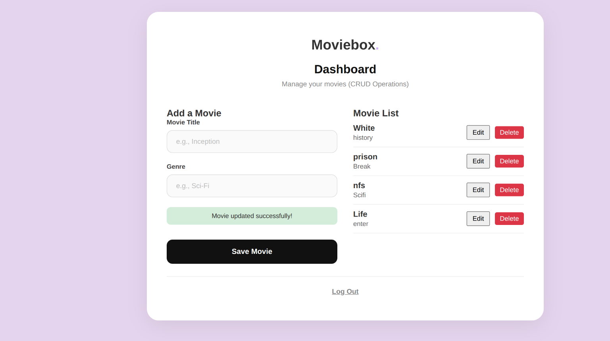
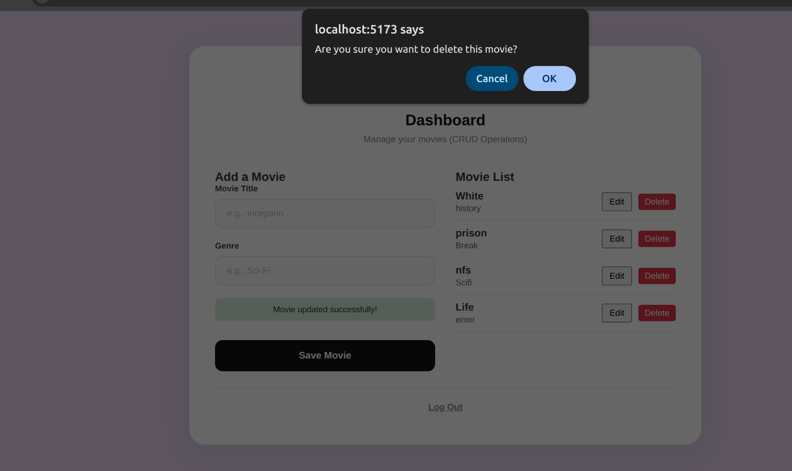

# Week 6: Movie CRUD Operations

This folder contains the source code for the Movie Management System CRUD (Create, Read, Update, Delete) operations.

## Tech Stack
* **Frontend**: React (Vite)
* **Backend**: Node.js (Express)
* **Database**: MySQL

## Files Included
* `source_code/frontend/MovieForm.jsx`: The React component responsible for displaying the Movie Dashboard, allowing users to Create, Read, Update, and Delete movies via the API.
* `source_code/backend/server.js`: The Express server containing the REST API endpoints for `/api/movies` (GET, POST, PUT, DELETE).
* `database.sql`: The database schema dump for the `movie_tracker_db`.

## Screenshots & Explanation
*(Please save your screenshots into a `screenshots/` folder in this directory and update the links below if necessary)*

### 1. Database Structure & Records

**Explanation**: This screenshot demonstrates the successful integration of the MySQL database. It shows the `movies` table populated with the records inserted via the web application, confirming that the backend correctly connects to and manipulates the database.

### 2. Create & Read Operations

**Explanation**: Here, the Dashboard is shown. The left side handles the **Create** operation (inserting a new movie), while the right side handles the **Read** operation (fetching all movies from the database and displaying them). The success message confirms data was successfully sent to the server.

### 3. Update Operation

**Explanation**: This demonstrates the **Update** operation. After clicking the 'Edit' button, the movie's data is loaded back into the form. Submitting it modifies the existing record in the database rather than creating a new one.

### 4. Delete Operation

**Explanation**: This shows the **Delete** operation. Clicking 'Delete' prompts a confirmation dialog to prevent accidental deletion. Upon confirming, the application sends a DELETE request to the backend to remove the specific record from the database.
