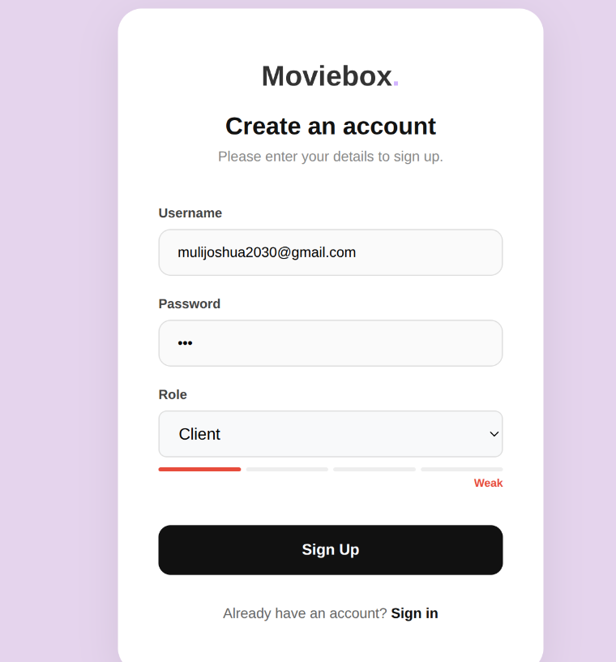
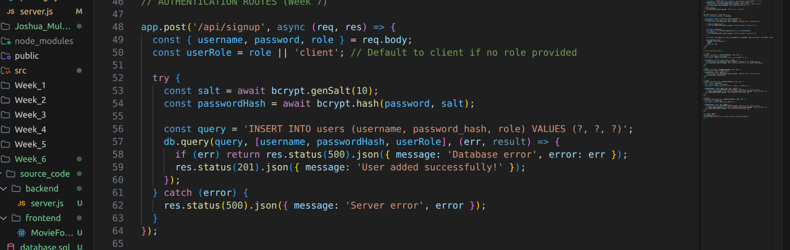
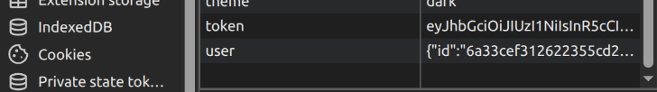
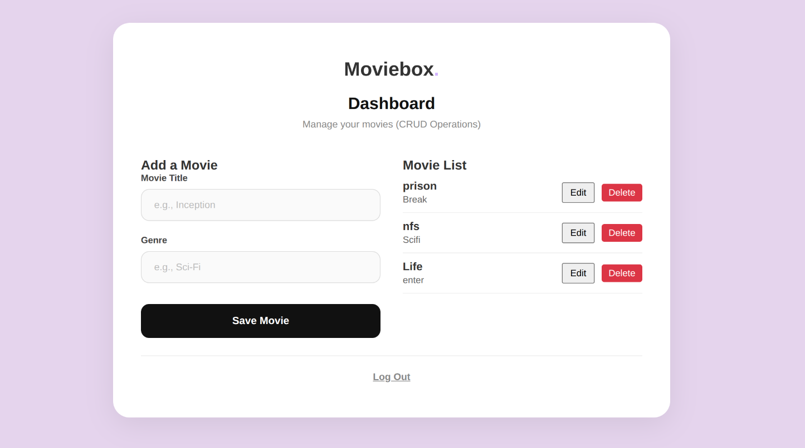

# Week 7: User Authentication and Session Management

This folder contains the source code for the Movie Management System User Authentication and Session Management operations.

## Tech Stack
* **Frontend**: React (Vite)
* **Backend**: Node.js (Express), bcrypt, jsonwebtoken
* **Database**: MySQL

## Files Included
* `source_code/frontend/LoginForm.jsx`: The React component for user Registration and Login. It saves the JWT token to `localStorage` upon successful login.
* `source_code/frontend/App.jsx`: The React component that manages the session state (`isLoggedIn`) and routes protected views.
* `source_code/backend/server.js`: The Express server containing the REST API endpoints for `/api/signup` (hashes passwords with bcrypt) and `/api/login` (verifies passwords and returns a JWT token). It also includes the `authenticateToken` middleware to protect routes.
* `database.sql`: The database schema dump for the `movie_tracker_db`, including the `users` table.

## Screenshots & Explanation
*(Please save your screenshots into a `screenshots/` folder in this directory and update the links below if necessary)*

### 1. User Registration Form with Roles

**Explanation**: This screenshot shows the "Create an account" (Sign Up) form. It includes the required fields for Username and Password, and importantly, the "Role" dropdown (Client, Admin, Managerial) which demonstrates multi-user authentication support from the UI level.

### 2. Database Authentication Setup

**Explanation**: This shows the `users` table within the database. It proves that user passwords are securely hashed using bcrypt (`password_hash` column) rather than being stored in plain text. It also verifies that the selected user roles are correctly stored in the database.

### 3. Secure Login & Session Management

**Explanation**: This screenshot of the browser Developer Tools (Local Storage) demonstrates that upon successful login, the server issues a secure JSON Web Token (JWT) that the frontend stores. This mechanism ensures secure, stateless session management.

### 4. Protected Dashboard & Logout

**Explanation**: This displays the protected Movie Dashboard, confirming that only authenticated users can access this page. The presence of the "Log Out" button demonstrates that users can successfully terminate their secure session.
