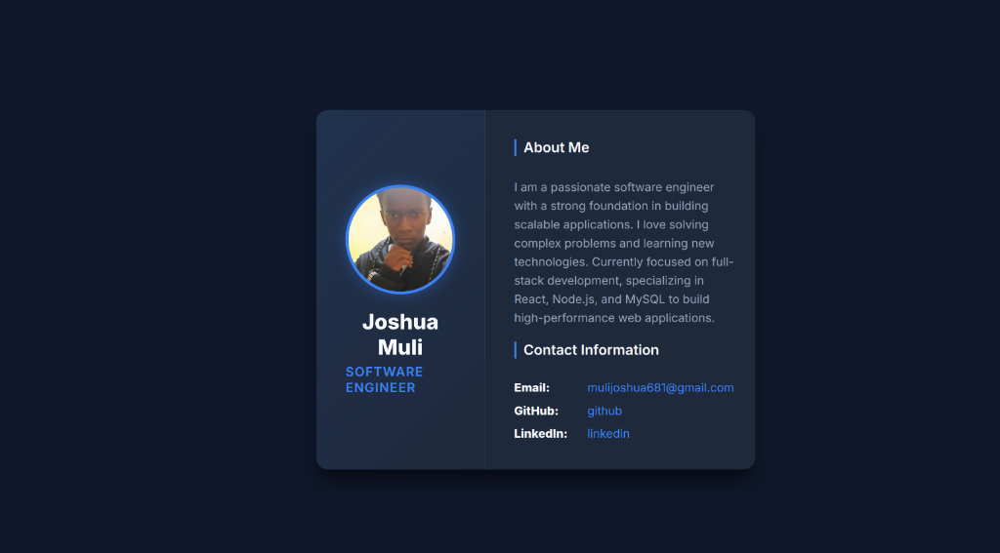
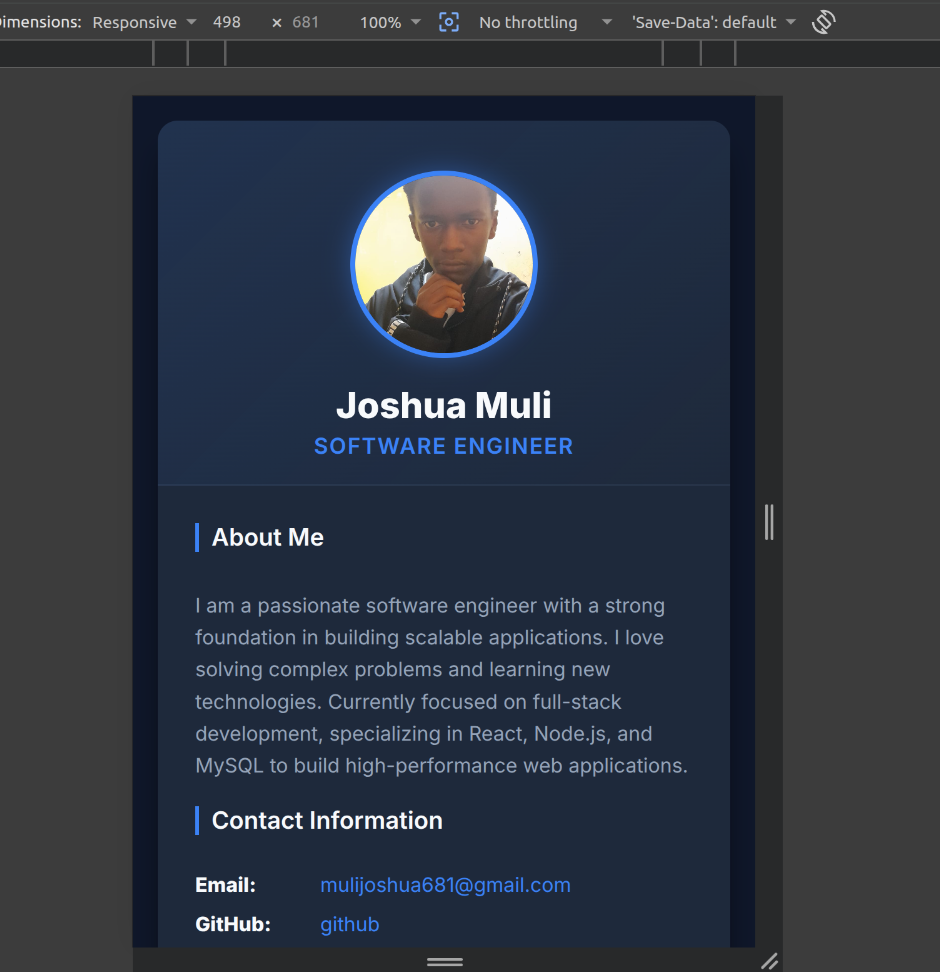
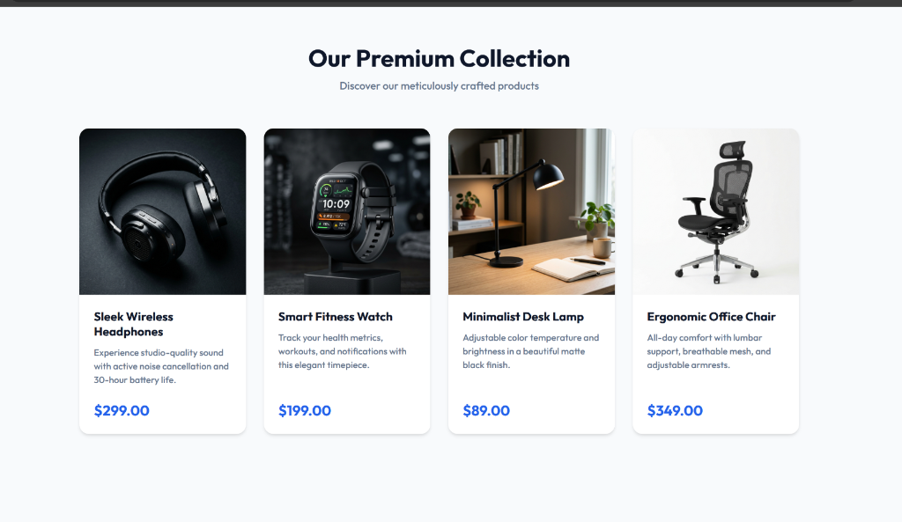
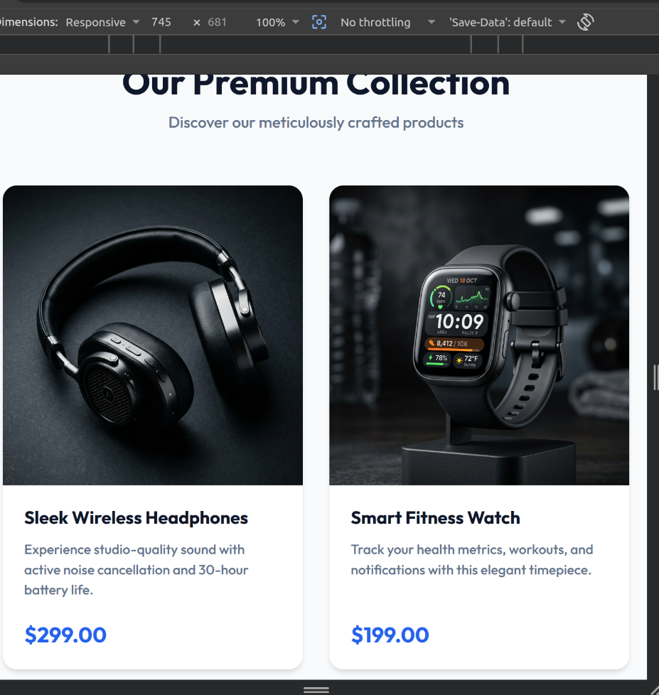
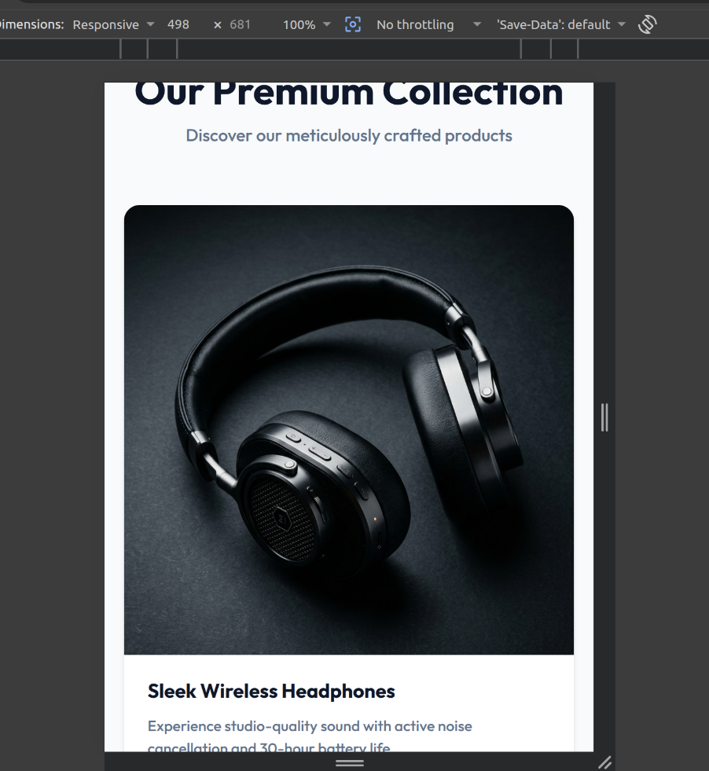
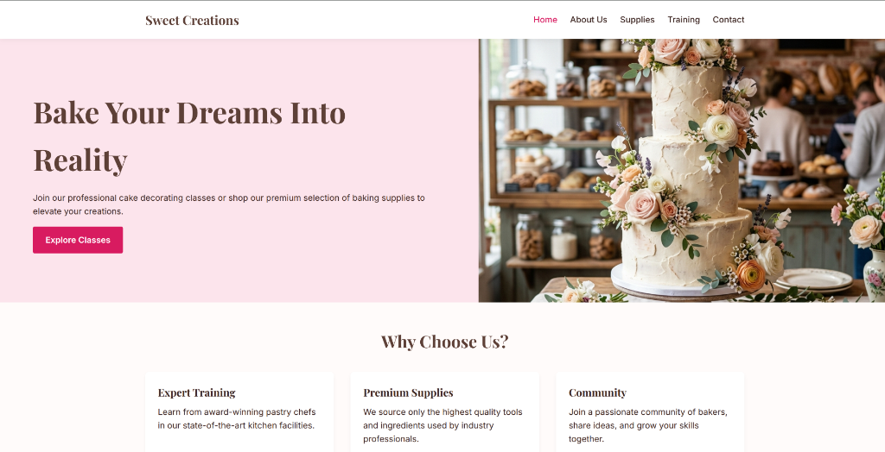
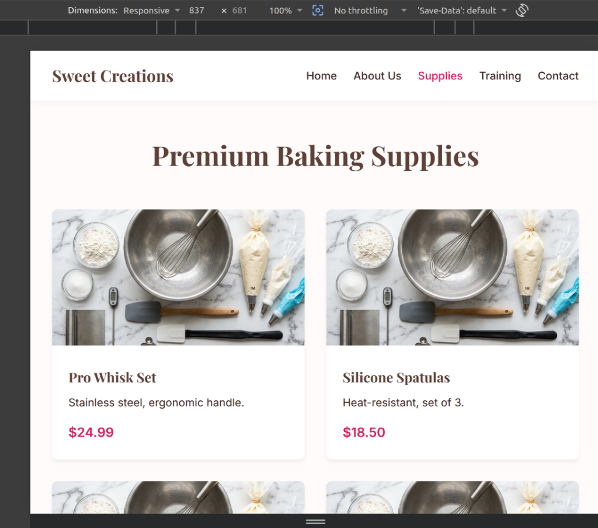
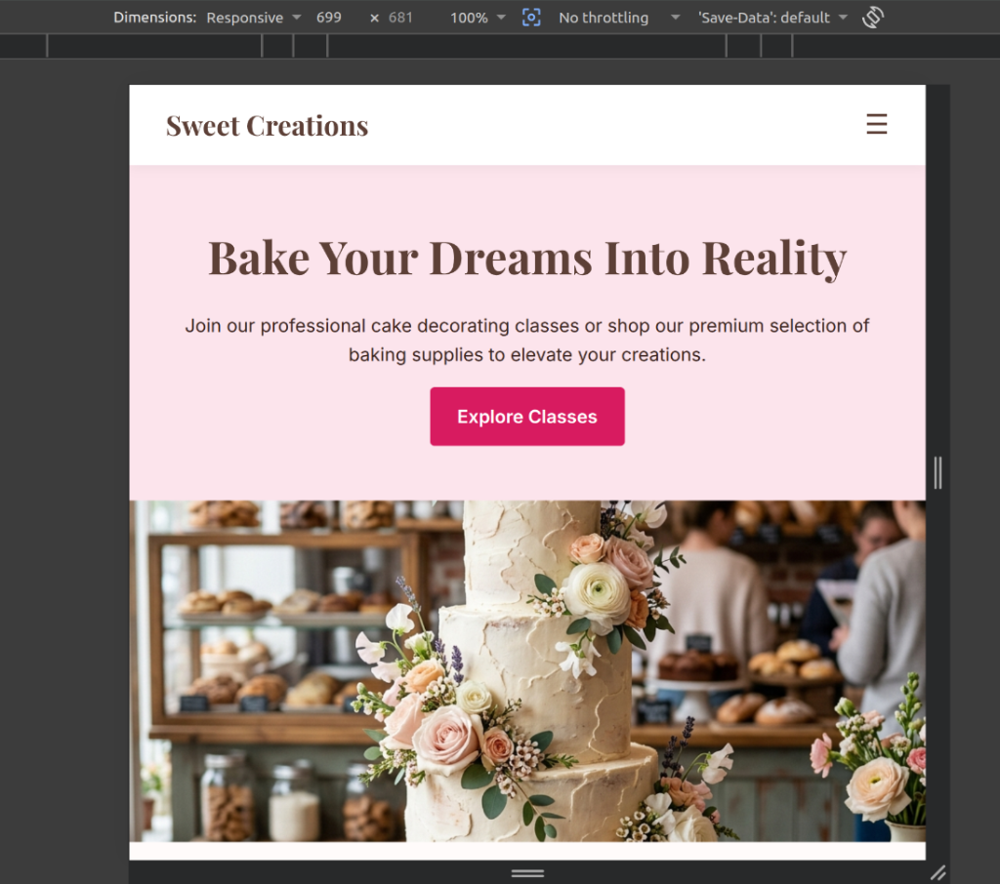

# Week 8: Responsive Web Design and Mobile-First Development

## Task 1: Responsive Personal Profile Page
This section demonstrates the Responsive Personal Profile Page. The layout uses Flexbox and media queries to adapt automatically between desktop and mobile devices.

### Desktop View

### Mobile View

---

## Task 2: Responsive Product Showcase
This section demonstrates the Responsive Product Showcase. The layout uses CSS Grid and a Mobile-First design approach to adjust the number of products displayed per row based on the device screen size.

### Desktop View (Multiple products per row)

### Tablet View (Fewer products per row)

### Mobile View (Single product per row)

---

## Task 3: Cake Training and Supplies Website
This section demonstrates the comprehensive Responsive Website built for the Cake Training and Supplies business. The design is fully responsive across different breakpoints.

### Desktop View (Home Page)

### Tablet View (Supplies Page)

### Mobile View (Home Page)

